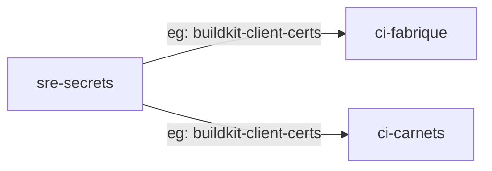
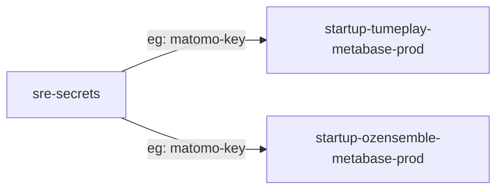
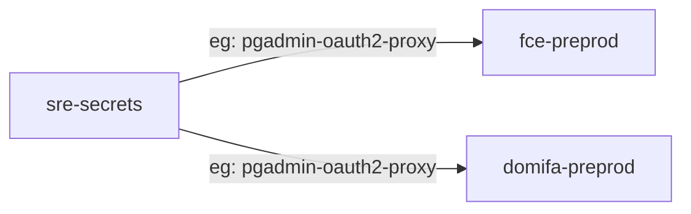
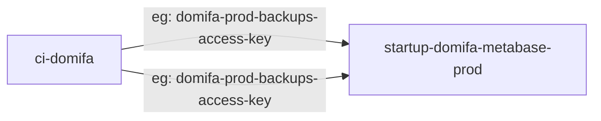
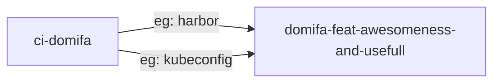

# kyverno secrets sync cluster policies

## cluster policies

### common to ci namespace

policy: **sync-secrets-common-to-ci-ns**




### internal shared sre secrets

policy: **sync-sre-secrets**




### external shared sre secrets

policy: **sync-sre-secrets-to-startups**



label to put on destination namespace:
```yaml
metadata:
  labels:
    secrets.sre.socialgouv.github.io/pgadmin-oauth2-proxy: pgadmin-oauth2-proxy
````

### secrets from startups used by sre

policy: **sync-sre-secrets-from-startups**

label to put on destination namespace:
```yaml
metadata:
  labels:
    sre.socialgouv.github.io/startup: domifa
````




### secrets from ci namespace to startup's namespaces


policy: **sync-secrets-from-ci-ns**

based on guaranteed rancher project scope relying on namespace annotation: `field.cattle.io/projectId`




## re-trigger kyverno (hard refresh)

```sh
./trigger-namespaces
```